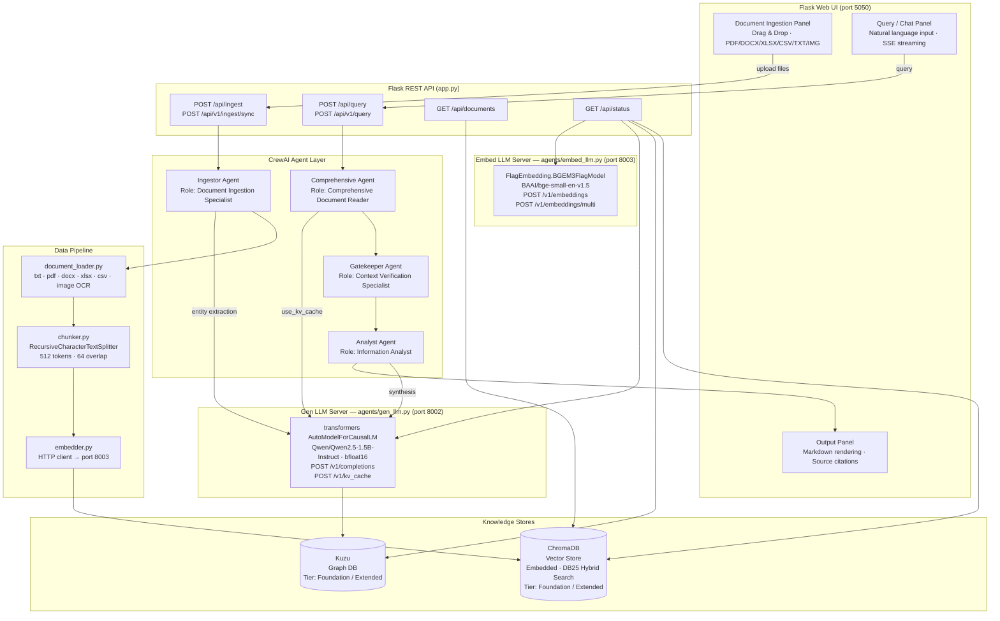
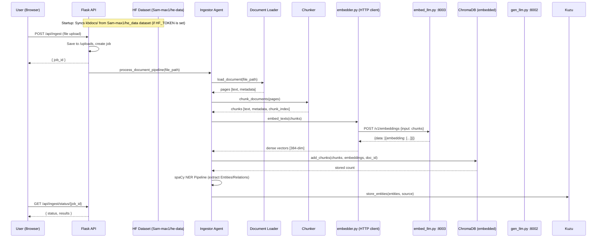
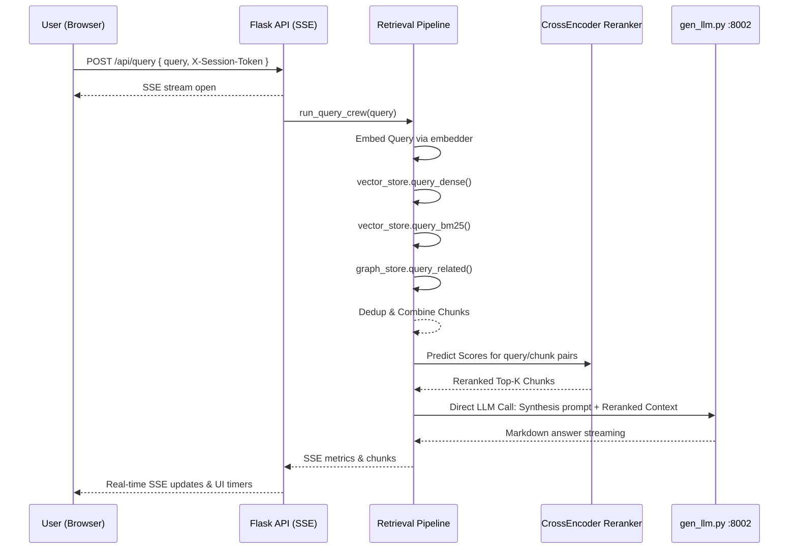

# Document AI Expert — Architecture Design

> AI-powered document analysis using hybrid RAG (Vector DB + Graph DB) with CrewAI agents.

---

## System Overview



---

## Data Flow

### Ingestion Path



### Query / Retrieval Path



---

## Microservices

### `agents/gen_llm.py` — LLM Generation Server (port 8002)

| Item | Value |
|---|---|
| **Port** | `8002` |
| **Model** | `Qwen/Qwen2.5-1.5B-Instruct` |
| **Quantization** | bfloat16 (bitsandbytes) — ~3 GB RAM/VRAM |
| **Backend** | `transformers` AutoModelForCausalLM (`device_map="auto"`) |
| **Start** | `python agents/gen_llm.py` |
| **Endpoints** | `GET /health`, `POST /v1/completions`, `POST /v1/kv_cache` |

**Request — `POST /v1/completions`:**
```json
{
  "prompt":       "The capital of France is",
  "max_tokens":   2048,
  "temperature":  0.7,
  "top_p":        0.9,
  "thinking_mode": false
}
```
**Response:**
```json
{
  "model": "Qwen/Qwen2.5-1.5B-Instruct",
  "choices": [{ "index": 0, "text": " Paris.", "thinking": "" }]
}
```

**Health Response:**
```json
{
  "status": "ok",
  "model": "Qwen/Qwen2.5-1.5B-Instruct",
  "quantization": "bfloat16 (bitsandbytes)",
  "gpu_id": "cuda:0",
  "kv_cache_length": 1024
}
```

---

### `agents/embed_llm.py` — Embedding Server (port 8003)

| Item | Value |
|---|---|
| **Port** | `8003` |
| **Model** | `BAAI/bge-small-en-v1.5` |
| **Backend** | `FlagEmbedding.BGEM3FlagModel` (fp16) |
| **Start** | `python agents/embed_llm.py` |
| **Endpoints** | `GET /health`, `POST /v1/embeddings`, `POST /v1/embeddings/multi` |

**Request — `POST /v1/embeddings`** (OpenAI-compatible, dense only):
```json
{ "input": "What is covered under plan X?" }
```
**Response:**
```json
{
  "object": "list",
  "model":  "BAAI/bge-small-en-v1.5",
  "data":   [{ "object": "embedding", "index": 0, "embedding": [0.021, -0.043, ...] }]
}
```

**Request — `POST /v1/embeddings/multi`** (dense + sparse + ColBERT):
```json
{
  "sentences_1": ["What is BGE M3?"],
  "sentences_2": ["BGE M3 is an embedding model supporting dense retrieval..."],
  "weights":     [0.4, 0.2, 0.4]
}
```
**Response includes:** `dense_similarity`, `lexical_weights_1/2`, `colbert_scores`, `combined_scores`

---

## Component Descriptions

| Component | File | Responsibility |
|---|---|---|
| **Gen LLM Server** | `agents/gen_llm.py` | Flask :8002 — Jackrong/Qwen3.5-2B Reasoning Distilled GGUF (via llama-cpp), `/v1/completions`, `/health` |
| **Embed LLM Server** | `agents/embed_llm.py` | Flask :8003 — BAAI/bge-small-en-v1.5, `/v1/embeddings`, `/health` |
| Config | `config.py` | All settings; LLM_BASE_URL (8002) + EMBED_BASE_URL (8003); ChromaDB path; override via env vars |
| Retrieval Pipeline | `agents/crew.py` | Executes DB25 hybrid search + Graph search + CrossEncoder re-ranking + Direct LLM generation |
| Document Loader | `pipeline/document_loader.py` | Parse 9 file formats; OCR for images |
| Chunker | `pipeline/chunker.py` | Recursive splitting (langchain_text_splitters), flat chunk dicts |
| Vector Store | `pipeline/vector_store.py` | **ChromaDB** CRUD, **DB25 hybrid search** (Dense + BM25), tier support |
| Graph Store | `pipeline/graph_store.py` | Kuzu CRUD, OPTIONAL MATCH, tier support |
| Flask App | `app.py` | REST API + Docker control + Tier Access Admin Auth + KV trigger + Health Metrics + Headless v1 API |
| CLI | `healthexpert.py` | Standalone command-line interface |
| UI Template | `templates/index.html` | Three-panel SPA + Docker buttons + preset prompts + diagnostic log |
| Styles | `static/style.css` | Dark glassmorphism + Docker modal + log box + preset btn styles |
| JavaScript | `static/app.js` | Fetch/SSE + diag logger + Docker control + probe handlers |
| Test Doc | `HEALTHEXPERT_UNIT_INTEGRATION_TEST.md` | 12-suite test spec with runnable commands |

---

## Technology Stack

| Layer | Technology | Version | Reason |
|---|---|---|---|
| Web Framework | Flask | 3.0+ | Lightweight, SSE support |
| LLM Backend | llama-cpp-python | 0.2+ | CPU/GPU optimized execution for GGUF models |
| LLM Model | Jackrong/Qwen3.5-2B-Claude-4.6-Opus-Reasoning-Distilled-GGUF | — | Tiny reasoning-distilled edge model |
| NLP & Graph Extractor | spaCy | 3.7+ | Lightning-fast local NER and relationship extraction |
| Embedding Backend | sentence-transformers | — | Local bge-small execution |
| Embedding Model | BAAI/bge-small-en-v1.5 | — | 1024-dim dense + sparse + ColBERT |
| Vector Database | **ChromaDB** | 0.5+ | Embedded persistent store — no server required |
| Hybrid Search | **rank-bm25** | 0.2+ | BM25 scorer for DB25 (Dense + BM25) keyword fusion |
| Graph Database | Kuzu Community | 5.18 | APOC plugins, multi-hop traversal |
| PDF | PyMuPDF (fitz) | 1.24+ | Fast, accurate text extraction |
| DOCX | python-docx | 1.1+ | Paragraph-level extraction |
| XLSX/CSV | pandas + openpyxl | 2.0+ | Sheet-aware chunking |
| Image OCR | pytesseract + Pillow | — | Local OCR, no cloud |
| Markdown | marked.js | CDN | Client-side rendering |

---

## DB25 Hybrid Search

**DB25** = **D**ense vector search + **B**M**25** keyword scoring, fused via **Reciprocal Rank Fusion (RRF)**.

Implemented entirely in `pipeline/vector_store.py` — no external service required.

### How It Works

```
query(query_embedding, keyword="coverage limit")
  │
  ├─ Step 1: Dense ANN (ChromaDB cosine)
  │   Fetch top_k × 4 candidates by vector similarity
  │
  ├─ Step 2: BM25 scoring (rank_bm25)
  │   Score same candidate pool using tokenised keyword query
  │
  └─ Step 3: RRF Fusion
      score = 1/(60 + dense_rank) + 1/(60 + bm25_rank)
      Sort descending → return top_k
```

### Advantages

| Property | Pure Dense | Pure BM25 | DB25 (Hybrid) |
|---|---|---|---|
| Semantic similarity | ✅ Strong | ❌ None | ✅ Strong |
| Exact keyword match | ❌ Weak | ✅ Strong | ✅ Strong |
| Handles typos / paraphrase | ✅ | ❌ | ✅ |
| Recall | Moderate | Moderate | **High** |
| Precision for precise terms | Low | High | **High** |

When `keyword=None` (e.g., internal KV cache calls), the system falls back to pure dense search.

---

## LLM Selection Criteria

### 🔍 Embedding Model — BAAI/bge-small-en-v1.5
**Best for: Complex Hybrid Search (Dense + Sparse + ColBERT)**

| Property | Detail |
|---|---|
| **Parameters** | ~567M |
| **VRAM (fp16)** | ~2 GB |
| **Context Window** | 8,192 tokens |
| **Embedding Dim** | 1,024 (dense) |
| **Vector Types** | Dense · Sparse (lexical) · Multi-vector (ColBERT) |
| **Languages** | 100+ (multilingual) |

**Why "M3"?** The name stands for three core capabilities:

- 🌐 **Multi-lingual** — natively handles 100+ languages without separate language models
- 📐 **Multi-granularity** — works at sentence, paragraph, and document level
- 🎯 **Multi-task** — generates all three vector types in a single forward pass:
  - **Dense vectors** — semantic similarity (standard RAG)
  - **Sparse vectors** — keyword-based weights (BM25-style lexical matching)
  - **ColBERT vectors** — token-level interaction for fine-grained re-ranking

---

### 🧠 Generation Model — Jackrong/Qwen3.5-2B Reasoning-Distilled (GGUF)
**The Edge Powerhouse: Best Sub-3B Reasoning Model**

| Property | Detail |
|---|---|
| **Parameters** | ~2B |
| **RAM (Q4_K_M)** | ~2.5 GB ✅ |
| **Context Window** | 8,192 tokens |
| **Quantization** | `GGUF (Q4_K_M)` |
| **Architecture** | Reasoning-Distilled (Claude 4.6 Opus) |
| **Inference Backend** | `llama-cpp-python` |

**Why GGUF & llama-cpp?**
- **Edge Deployment**: GGUF formats allow deployment on strictly CPU-bound instances (like HuggingFace Spaces) with high performance.
- **Reasoning Distillation**: The model is distilled from Opus, enabling it to perform structured reasoning (wrapped in `<think>` tags) even at 2B parameters.
- **Thread Optimization**: Predictable performance scaling across cores using `llama.cpp` thread pinning.

---

### Selection Summary

| Criterion | BAAI/bge-small-en-v1.5 (port 8003) | Jackrong/Qwen3.5-2B GGUF (port 8002) |
|---|---|---|
| **Role** | Embedding / Retrieval | Text Generation / Synthesis |
| **RAM** | ~130 MB | ~2.5 GB (Q4_K_M) |
| **Strength** | Fast local dense embeddings | Complex reasoning + reasoning distillation |
| **Context** | 512 tokens | 8,192 tokens |
| **Used by** | `pipeline/embedder.py` via HTTP | `agents/gen_llm.py` via HTTP |

---

## Execution Roles (Direct Pipeline)

We have transitioned away from heavy LLM orchestration frameworks (like CrewAI) to a streamlined, direct execution pipeline.

### 🗂️ Ingestion Pipeline (`process_document_pipeline`)
- **Process**: Load → Chunk → Embed (via port 8003) → Store (**ChromaDB**)
- **Graph Extraction**: Runs asynchronously using `spaCy` (NLP) to extract Named Entities (NER) and syntactic relationships, pushing them into Kuzu Graph DB.

### 🔍 Retrieval Pipeline (`run_query_crew`)
- **Retrieval**: Triggers parallel fetches from **Vector DB** (ChromaDB), **Graph DB** (Kuzu), and **BM25** index.
- **Cross-Encoder Fusion**: The unique chunks are combined and passed through an extremely fast Cross-Encoder model (`ms-marco-MiniLM-L-6-v2`) to intelligently re-rank and filter out context that is semantically irrelevant to the user's specific query.

### 📊 Synthesis Phase
- **Process**: The reranked Top-K context is formatted into a zero-shot prompt and passed directly to the Gen LLM (via port 8002) for real-time SSE streaming answer generation with source citations.

---

## Deployment

### Quick Start (Local)

```bash
# ── One-time setup ─────────────────────────────────────────────────────────────

# Install Docker Compose V2 plugin (for Kuzu only)
mkdir -p ~/.docker/cli-plugins
curl -SL https://github.com/docker/compose/releases/latest/download/docker-compose-linux-x86_64 \
     -o ~/.docker/cli-plugins/docker-compose
chmod +x ~/.docker/cli-plugins/docker-compose
docker compose version          # → Docker Compose version v5.x.x

# Add your user to the docker group
sudo usermod -aG docker $USER
newgrp docker                   # activate in the current shell immediately

# ── Per-session startup ────────────────────────────────────────────────────────

# 1. Start Kuzu graph database (ChromaDB is embedded — no docker needed for vector DB)
cd /source/python/code/healthexpert
docker compose up -d

# 2. Install Python dependencies
pip install -r requirements.txt

# 3. (Optional) Install tesseract for OCR
sudo apt-get install -y tesseract-ocr

# 4. Start the Gen LLM server (port 8002)  — in a dedicated terminal
python agents/gen_llm.py
# → https://127.0.0.1:8002/v1/completions  (Qwen/Qwen2.5-1.5B-Instruct, bfloat16)

# 5. Start the Embed LLM server (port 8003) — in a dedicated terminal
python agents/embed_llm.py
# → https://127.0.0.1:8003/v1/embeddings

# 6. Start the Flask web app (port 5050)   — in a dedicated terminal
python app.py
# → https://127.0.0.1:5050
# ChromaDB will auto-create data/chroma_db/ on first ingest

# 7. Or use CLI (requires both servers running)
python healthexpert.py ingest policy.pdf
python healthexpert.py query "What is covered under plan X?"
python healthexpert.py list
python healthexpert.py status
```

### HuggingFace Spaces & Docker (Headless/Cloud)

The system is provided with a `Dockerfile` designed for simple "one-click" deployment on platforms like HuggingFace Spaces. 

```bash
docker build -t healthexpert .
docker run -p 7860:7860 -it healthexpert
```

This Docker setup:
1. Installs all required OS-level dependencies (like `tesseract-ocr` for document parsing).
2. Sets `PORT=7860` (the standard for HuggingFace Spaces).
3. Uses `start.sh` as the `ENTRYPOINT`, which sequentially launches `embed_llm.py` on port 8003, `gen_llm.py` on port 8002, and finally `app.py` bound to `0.0.0.0:$PORT`.
4. Gracefully disables Kuzu graph extensions, allowing the system to fall back seamlessly to ChromaDB-only vector RAG mode (standard behavior when a graph DB isn't reachable).

### Environment Variables

| Variable | Default | Description |
|---|---|---|
| `LLM_BASE_URL` | `https://127.0.0.1:8002` | Gen LLM server URL (gen_llm.py) |
| `LLM_MODEL_ID` | `Qwen/Qwen2.5-1.5B-Instruct` | Model identifier |
| `HF_PRIVATE_TOKEN` | `None` | Token to sync private KB dataset Sam-max1/he-data |
| `GEN_HOST` | `127.0.0.1` | gen_llm.py bind host |
| `GEN_PORT` | `8002` | gen_llm.py bind port |
| `EMBED_BASE_URL` | `https://127.0.0.1:8003` | Embed LLM server URL (embed_llm.py) |
| `EMBEDDING_MODEL` | `BAAI/bge-small-en-v1.5` | Embedding model identifier |
| `EMBED_HOST` | `127.0.0.1` | embed_llm.py bind host |
| `EMBED_PORT` | `8003` | embed_llm.py bind port |
| `EMBED_FP16` | `true` | Use FP16 for embedding inference |
| `EMBED_MAX_LENGTH` | `8192` | Max token length for bge-small-en-v1.5 |
| `CHROMA_PERSIST_DIR` | `data/chroma_db` | ChromaDB persistent storage directory |
| `CHROMA_COLLECTION` | `Document` | ChromaDB collection name |
| `KUZU_URI` | `bolt://localhost:7687` | Kuzu bolt URI |
| `KUZU_PASSWORD` | `healthexpert` | Kuzu password |
| `CHUNK_SIZE` | `512` | Characters per chunk |
| `TOP_K_VECTOR` | `5` | Vector search top-K (DB25 returns top-K after fusion) |

---

## Admin Controls (Localhost Only)

The application provides a suite of powerful administrative capabilities accessible only when the UI is loaded from `localhost` (127.0.0.1). These controls appear in the top-right navigation bar.

1. **DB Up & DB Down**: Control the lifecycle of the **Kuzu** container directly from the UI via internal `docker compose` orchestration. ChromaDB is embedded and requires no lifecycle management.
2. **Purge DB**: A destructive action that deletes the ChromaDB collection and executes `MATCH (n) DETACH DELETE n` in Kuzu, wiping all ingested data instantly.
3. **Kill Switch**: An emergency abort mechanism. Issues `docker compose down` and forces a hard exit of the Flask server (`os._exit(0)`). Designed to halt runaway CrewAI inference loops.

---

## Directory Structure

```
healthexpert/
├── app.py                    Flask application (port 5050)
├── healthexpert.py           Standalone CLI
├── config.py                 Central configuration (both endpoints + ChromaDB path)
├── docker-compose.yml        Kuzu local instance (ChromaDB needs no container)
├── requirements.txt          Python dependencies
│
├── agents/
│   ├── gen_llm.py            ★ LLM Generation Server (port 8002)
│   │                             transformers · Qwen/Qwen2.5-1.5B-Instruct · bfloat16
│   │                             POST /v1/completions · POST /v1/kv_cache
│   ├── embed_llm.py          ★ Embedding Server (port 8003)
│   │                             FlagEmbedding BGEM3 · BAAI/bge-small-en-v1.5
│   │                             POST /v1/embeddings · POST /v1/embeddings/multi
│   ├── llm.py                LangChain wrapper → port 8002
│   ├── tools.py              CrewAI @tool functions
│   └── crew.py               Crew assembly & execution
│
├── pipeline/
│   ├── document_loader.py    Multi-format document parser
│   ├── chunker.py            Text splitting
│   ├── embedder.py           HTTP client → port 8003
│   ├── vector_store.py       ★ ChromaDB wrapper + DB25 hybrid search
│   └── graph_store.py        Kuzu wrapper
│
├── templates/
│   └── index.html            Three-panel SPA
│
├── static/
│   ├── style.css             Dark glassmorphism design
│   └── app.js                Frontend logic (SSE, Markdown)
│
├── kbdocs/                   ★ Ignored local docs, auto-synced from HF Dataset if token set
├── uploads/                  Temporary file storage
└── data/
    ├── security.key          Fernet encryption key
    └── chroma_db/            ★ ChromaDB persistent vector store
```
