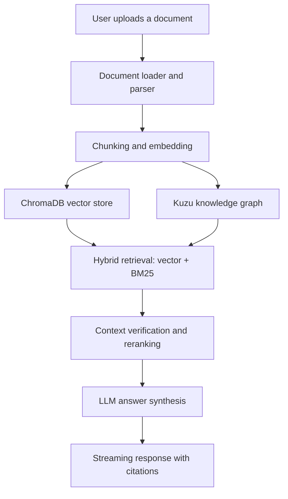

# HealthExpert 🏥

<div align="center">

[](https://www.python.org/)
[](https://flask.palletsprojects.com/)
[](https://crewai.com/)
[](LICENSE)
[](https://sam-max1-healthexpert.hf.space/)
[](https://github.com/Sam-max1/healthexpert)

</div>

<p align="center">
  
</p>

HealthExpert is an AI-powered document intelligence platform that turns PDFs, Word files, spreadsheets, and other business documents into grounded answers with citations, retrieval context, and a polished web experience. The project is live and ready to try at <a href="https://sam-max1-healthexpert.hf.space/">https://sam-max1-healthexpert.hf.space/</a>.

> ⭐ If this project helps you, please give it a star. It helps the project grow and reach more users.

## Why HealthExpert?

HealthExpert combines retrieval-augmented generation, graph-based reasoning, and a production-friendly Flask UI to help users ask questions over large document collections without losing provenance. It is designed for teams that want fast, explainable answers from internal knowledge sources while keeping the experience simple for end users.

### What it can do

- Ingest and index documents in PDF, DOCX, XLSX, CSV, TXT, PNG, JPG, JPEG, and WEBP formats
- Extract text, chunk content, embed it, and store it in a hybrid retrieval stack
- Combine dense vector retrieval, BM25 keyword retrieval, and graph-based entity relationships
- Generate grounded answers with source-aware citations and streaming output
- Run as a local app, a Dockerized service, or a Hugging Face Space
- Expose both a web UI and a CLI for ingestion, querying, and system inspection
- Support admin controls, async ingestion jobs, session-aware workflows, and Hugging Face optimized mode

## Featured capabilities

- Multi-agent ingestion and analysis pipeline powered by CrewAI
- Hybrid RAG with ChromaDB, BM25 ranking, and Kuzu graph search
- Local and NVIDIA-backed LLM routing with expert/assistant modes
- Real-time streaming responses in the web UI
- Secure, rate-limited Flask API with admin monitoring endpoints
- CLI utilities for ingesting documents and checking system health
- Docker and Hugging Face Space deployment support

## System flow



## Architecture at a glance

HealthExpert is organized around three layers:

1. Frontend and API layer: Flask routes, session handling, streaming UI, and admin controls
2. Retrieval and knowledge layer: document parsing, chunking, embeddings, ChromaDB, BM25, and Kuzu
3. Inference layer: generation and embedding microservices plus optional NVIDIA backend support

## Live demo

Try the hosted experience here:

- Hugging Face Space: https://sam-max1-healthexpert.hf.space/

## Quick start

### Prerequisites

- Python 3.10+
- Docker and Docker Compose optional
- 8 GB RAM recommended
- CUDA or ROCm optional for accelerated local inference

### Install and run locally

```bash
git clone https://github.com/Sam-max1/healthexpert.git
cd healthexpert
python -m venv venv
source venv/bin/activate
pip install -r requirements.txt
```

Start the services:

```bash
python agents/gen_llm.py
python agents/embed_llm.py
python app.py
```

Open the app at http://localhost:5050.

### CLI usage

```bash
python healthexpert.py ingest path/to/document.pdf
python healthexpert.py query "What is the main topic?"
python healthexpert.py list
python healthexpert.py status
python healthexpert.py clear your-document.pdf
```

## Project structure

```text
healthexpert/
├── app.py                  # Flask web app and API routes
├── healthexpert.py         # CLI entry point
├── config.py               # Runtime configuration
├── agents/                 # LLM, crew, and service orchestration
├── pipeline/               # Loader, chunker, embeddings, and storage
├── templates/              # HTML UI templates
├── static/                 # JS and CSS assets
├── docker-compose.yml      # Optional container deployment
└── requirements*.txt       # Dependency sets for local and HF deployments
```

## Development notes

- Run tests with pytest from the repository root
- Use Docker Compose for local database and service orchestration
- Set HF_PRIVATE_TOKEN when using private Hugging Face-backed workflows

## Contributing

Contributions are welcome. Please open an issue or pull request if you want to improve the app, add new document formats, or refine the retrieval pipeline.

## License

This project is licensed under the MIT License. See [LICENSE](LICENSE) for details.

---

<div align="center">

⭐ If you found this project useful, please star the repository and share it with others.

</div>
